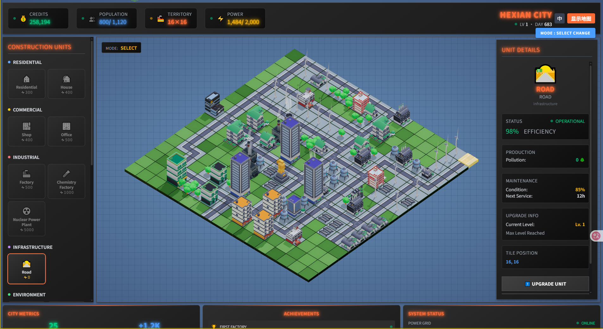
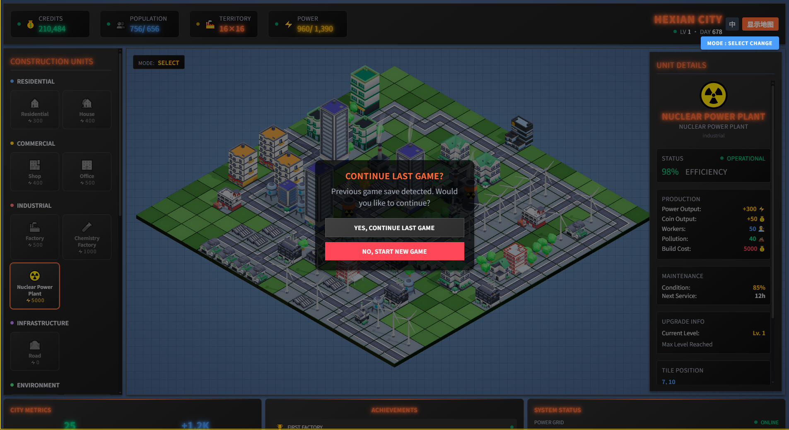

[中文版 README](./README.md)

# CubeCity: 2.5D Cartoon City-Building System

> A lightweight 2.5D city-building simulation game based on Three.js and Vue.

Welcome to CubeCity! This is a cartoon-style 2.5D city simulation game where you can build, manage, and expand your very own metropolis. Place buildings, lay down roads, and watch your city grow as you manage resources and expand your territory.


## ✨ Core Features

*   **🏙️ Free Construction:** Place, move, and demolish various buildings and roads as you wish to create a unique cityscape.
*   **🧩 Strategic Planning:** Balance the development of Residential (R), Commercial (C), and Industrial (I) zones, while also considering Environment (E), Society (S), and Governance (G) for sustainable city growth.
*   **💰 Economic System:** Buildings automatically generate coins. Use these coins to construct new buildings, upgrade, or expand your territory.
*   **💾 Local Storage:** Your city progress is automatically saved locally, so you can continue building anytime.
*   **🎨 Cartoon Style:** Bright colors and cute cartoon models provide a relaxing and enjoyable visual experience.

| Interface Overview                             | City Corner                                   | Offline Storage                               |
| :--------------------------------------------- | :--------------------------------------------- | :------------------------------------------- |
|  |  |  |

## 🎮 Gameplay Overview

The game revolves around four main operation modes, allowing you to easily manage all aspects of your city:

*   **🔍 Select Mode (SELECT):**
    *   Click buildings to view details such as population, status, and output.
    *   Upgrade buildings when conditions are met to enhance their functions and output.

*   **🏗️ Build Mode (BUILD):**
    *   Select the building you want from the left panel.
    *   Click on available land on the map to place buildings. Real-time model preview and highlight make operations intuitive.

*   **🚚 Relocate Mode (RELOCATE):**
    *   Select a built building, then click on an empty tile to relocate it easily.
    *   You can rotate the building before placement to fit your city layout.

*   **💣 Demolish Mode (DEMOLISH):**
    *   Switch to this mode and click unwanted buildings to demolish them.
    *   Demolishing returns part of the construction cost.

## 🛠️ Tech Stack

*   **Core Rendering:** [Three.js](https://threejs.org/)
*   **Frontend Framework:** [Vue 3](https://vuejs.org/)
*   **Build Tool:** [Vite](https://vitejs.dev/)
*   **UI & Styles:** [Tailwind CSS](https://tailwindcss.com/) & SCSS
*   **State Management:** [Pinia](https://pinia.vuejs.org/)
*   **Event Bus:** [mitt](https://github.com/developit/mitt)

## 📚 Documentation

*   **🎮 Player Guide:** [Game Guide](./docs/新手指南.md) - Detailed gameplay instructions and tips
*   **👨‍💻 Developer Guide:** [Developer Guide](./docs/新手开发指南.md) - Complete development environment setup and coding standards
*   **📋 Product Requirements:** [PRD Document](./docs/PRD.md) - Product requirements document
*   **🔧 Technical Design:** [TD Document](./docs/TD.md) - Technical design document

## 🚀 Roadmap

We plan to add more exciting features in the future, including:

*   **Dynamic Economic System:** Market demand will change dynamically based on your city's building ratio.
*   **Challenge & Failure Mechanisms:** Bankruptcy, population loss, environmental collapse, and other failure conditions to increase challenge.
*   **Strategic Building System:** Buildings will interact with each other, testing your planning skills.
*   **Dynamic Event System:** Random events like economic crises and immigration waves make city management unpredictable.
*   **Tech Tree & Policy System:** Unlock new technologies and enact policies to guide city development from a higher level.

## 🧑‍💻 Author

Developed by [hexianWeb](https://github.com/hexianWeb).

## 📄 License

This project is licensed under the [MIT License](LICENSE).

## New Feature: Building Status Cycling System 🔄

### Features

1. **Smart Status Display**
   - **Debuff Priority:** When a building has problem statuses, all debuffs are cycled first.
   - **Buff Fallback:** When there are no problems, all buffs are cycled.
   - **Smooth Transitions:** Statuses fade in and out for a smooth visual experience.

2. **Cycling Mechanism**
   - Automatically switches to the next status every 2.5 seconds
   - Static display for single status, auto-cycling for multiple statuses
   - Supports real-time status changes

3. **Status Categories**
   ```javascript
   DEBUFF: ['MISSING_ROAD', 'MISSING_POWER', 'MISSING_POPULATION', 'OVER_POPULATION', 'MISSING_POLLUTION']
   BUFF: ['POWER_BOOST', 'ECONOMY_BOOST', 'POPULATION_BOOST', 'COIN_BUFF', 'HUMAN_BUFF', 'UPGRADE']
   ```

### Usage Example

Configure statuses in building classes:

```javascript
this.statusConfig = [
  // === DEBUFF status (problem, cycled first) ===
  {
    statusType: 'MISSING_ROAD',
    condition: (building, gs) => {
      building.buffConfig = { targets: ['road'] }
      return !building.checkForBuffTargets(gs)
    },
    effect: { type: 'missRoad', offsetY: 0.7 },
  },

  // === BUFF status (bonus, cycled when no problems) ===
  {
    statusType: 'COIN_BUFF',
    condition: (building, gs) => {
      building.buffConfig = { targets: ['shop'], range: 1 }
      return building.checkForBuffTargets(gs)
    },
    effect: { type: 'coinBuff', offsetY: 0.7 },
  },
]
```

### Technical Implementation

- **Status Management:** Switch from single to array-based status management
- **Interval Cycling:** Use `setInterval` for automatic switching
- **Animation Optimization:** Dedicated `fadeOut` method for smooth transitions
- **Memory Safety:** Complete cleanup to prevent memory leaks

Reference: `src/js/components/tiles/buildings/park.js`
