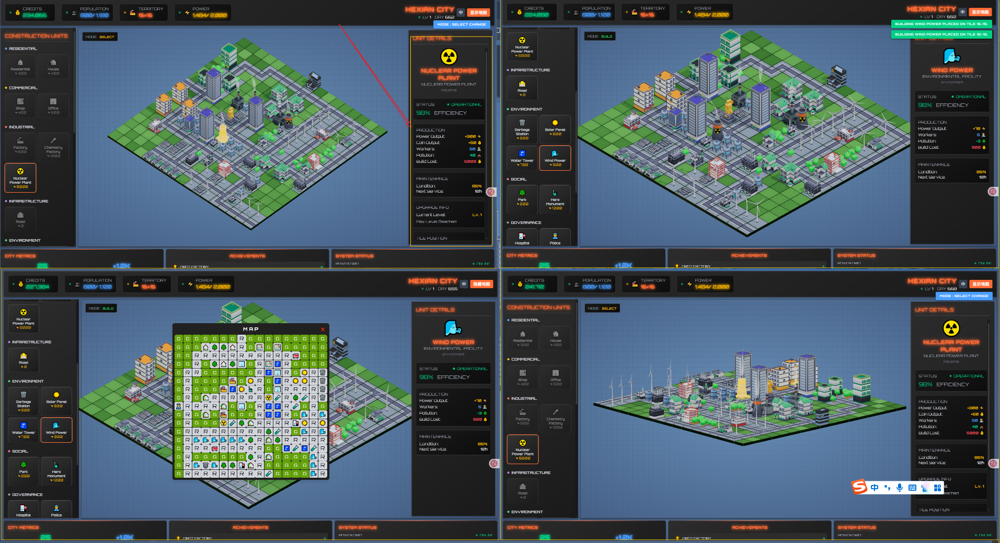
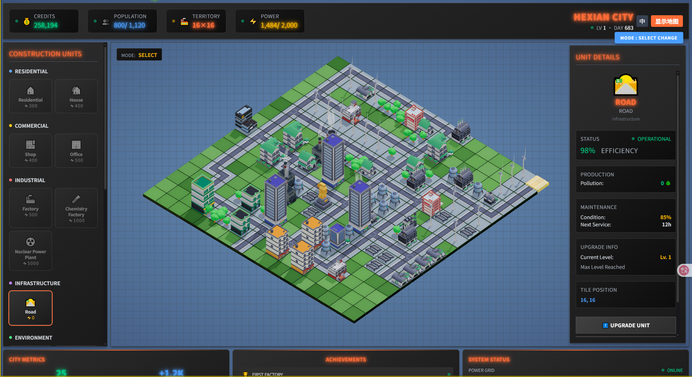
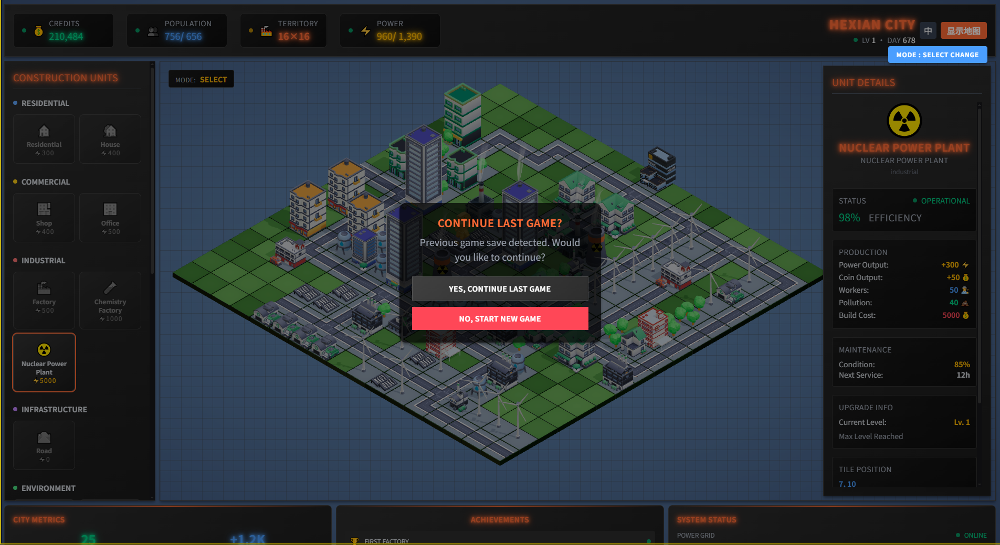

[English README](./README.en.md)

# CityVox - Sistema de Construcción de Ciudad 2.5D

> Un juego ligero de simulación de construcción de ciudades 2.5D basado en Three.js y Vue.

¡Bienvenido a CityVox! Este es un juego de simulación de ciudades 2.5D de estilo cartoon donde puedes construir, gestionar y expandir tu propia metrópolis. Coloca edificios, construye carreteras y observa cómo crece tu ciudad mientras gestionas recursos y expandes tu territorio.


## ✨ Características Principales

*   **🏙️ Construcción Libre:** Coloca, mueve y demoler libremente todo tipo de edificios y carreteras para crear un paisaje urbano único.
*   **🧩 Planificación Estratégica:** Equilibra el desarrollo residencial (R), comercial (C) e industrial (I), mientras consideras las necesidades ambientales (E), sociales (S) y de gobernanza (G) para lograr un desarrollo urbano sostenible.
*   **💰 Sistema Económico:** Los edificios generan automáticamente monedas de oro, utiliza estas monedas para construir nuevos edificios, mejorar o expandir tu territorio.
*   **💾 Almacenamiento Local:** El progreso de tu ciudad se guarda automáticamente localmente, puedes volver en cualquier momento para continuar tu proyecto de construcción.
*   **🎨 Estilo Cartoon:** Colores brillantes y modelos cartoon adorables que brindan una experiencia visual relajante y agradable.

| Vista General de la Interfaz                | Rincón de la Ciudad                           | Almacenamiento Offline                       |
| :------------------------------------------- | :--------------------------------------------- | :------------------------------------------- |
|  |  |  |

## 🎮 Introducción al Juego

El juego se centra principalmente en cuatro modos de operación que te permiten gestionar fácilmente todos los aspectos de tu ciudad:

*   **🔍 Modo Selección (SELECT):**
    *   Haz clic en los edificios para ver información detallada como número de residentes, estado, producción, etc.
    *   Cuando se cumplan las condiciones, puedes mejorar los edificios para aumentar su funcionalidad y producción.

*   **🏗️ Modo Construcción (BUILD):**
    *   Selecciona el edificio que deseas del panel izquierdo.
    *   Haz clic en terrenos disponibles en el mapa para colocar edificios, con vista previa en tiempo real y resaltado intuitivo.

*   **🚚 Modo Reubicación (RELOCATE):**
    *   Selecciona un edificio ya construido, luego haz clic en un terreno vacío para completar fácilmente la reubicación.
    *   Antes de colocar, puedes rotar el edificio para adaptarlo al diseño de tu ciudad.

*   **💣 Modo Demolición (DEMOLISH):**
    *   Cambia a este modo y haz clic en edificios que ya no necesites para demolerlos.
    *   Demoler edificios devuelve parte del costo de construcción.

## 🛠️ Stack Tecnológico

*   **Renderizado Principal:** [Three.js](https://threejs.org/)
*   **Framework Frontend:** [Vue 3](https://vuejs.org/)
*   **Herramienta de Construcción:** [Vite](https://vitejs.dev/)
*   **UI & Estilos:** [Tailwind CSS](https://tailwindcss.com/) & SCSS
*   **Gestión de Estado:** [Pinia](https://pinia.vuejs.org/)
*   **Bus de Eventos:** [mitt](https://github.com/developit/mitt)

## 📚 Documentación

*   **🎮 Guía para Principiantes:** [Guía de Juego](./docs/Guia-de-Juego.md) - Explicaciones detalladas de la jugabilidad y consejos
*   **👨‍💻 Guía de Desarrollo:** [Guía de Desarrollo para Principiantes](./docs/Guia-de-Desarrollo.md) - Configuración completa del entorno de desarrollo y estándares
*   **📋 Requisitos del Producto:** [Documento PRD](./docs/PRD-ES.md) - Documento de requisitos del producto
*   **🔧 Diseño Técnico:** [Documento TD](./docs/TD-ES.md) - Documento de diseño técnico

## 🚀 Perspectivas Futuras

Planificamos agregar más funciones interesantes al juego en el futuro, incluyendo:

*   **Sistema Económico Dinámico:** La demanda del mercado cambiará dinámicamente según la proporción de edificios en tu ciudad.
*   **Mecanismos de Desafío y Fracaso:** Introducir condiciones de fracaso como bancarrota, pérdida de población, colapso ambiental, etc., para aumentar el desafío del juego.
*   **Sistema de Edificios Estratégicos:** Los edificios se influirán mutuamente, poniendo a prueba tus habilidades de planificación.
*   **Sistema de Eventos Dinámicos:** Eventos aleatorios como crisis económicas, oleadas migratorias, etc., harán que la gestión urbana esté llena de variables.
*   **Árbol Tecnológico y Sistema de Políticas:** Desbloquear nuevas tecnologías, promulgar nuevas políticas, guiar el desarrollo urbano desde una dimensión superior.

## 🧑‍💻 Autor

Desarrollado por Carlos Freire.

## 📄 Licencia

Este proyecto está licenciado bajo la [Licencia MIT](LICENSE).

## Nueva Funcionalidad: Sistema de Visualización Rotativa de Estados de Edificios 🔄

### Características de la Funcionalidad

1. **Visualización Inteligente Categorizada**
   - **Prioridad Debuff**: Cuando el edificio tiene estados problemáticos, se muestran rotativamente todos los estados debuff con prioridad
   - **Buff de Respaldo**: Cuando no hay estados problemáticos, se muestran rotativamente todos los estados de beneficio
   - **Transición Suave**: Animaciones de fade in/out entre estados para una experiencia visual fluida

2. **Mecanismo Rotativo**
   - Cambio automático cada 2.5 segundos al siguiente estado
   - Visualización estática para un solo estado, rotación automática para múltiples estados
   - Soporte para respuesta a cambios de estado en tiempo real

3. **Clasificación de Estados**
   ```javascript
   DEBUFF: ['MISSING_ROAD', 'MISSING_POWER', 'MISSING_POPULATION', 'OVER_POPULATION', 'MISSING_POLLUTION']
   BUFF: ['POWER_BOOST', 'ECONOMY_BOOST', 'POPULATION_BOOST', 'COIN_BUFF', 'HUMAN_BUFF', 'UPGRADE']
   ```

### Ejemplo de Uso

Configuración de estados en la clase de edificio:

```javascript
this.statusConfig = [
  // === Estados DEBUFF (estados problemáticos, rotación prioritaria) ===
  {
    statusType: 'MISSING_ROAD',
    condition: (building, gs) => {
      building.buffConfig = { targets: ['road'] }
      return !building.checkForBuffTargets(gs)
    },
    effect: { type: 'missRoad', offsetY: 0.7 },
  },

  // === Estados BUFF (estados de beneficio, rotación cuando no hay problemas) ===
  {
    statusType: 'COIN_BUFF',
    condition: (building, gs) => {
      building.buffConfig = { targets: ['shop'], range: 1 }
      return building.checkForBuffTargets(gs)
    },
    effect: { type: 'coinBuff', offsetY: 0.7 },
  },
]
```

### Implementación Técnica

- **Gestión de Estados**: Cambio de gestión de estado único a gestión de array de múltiples estados
- **Rotación Temporizada**: Uso de `setInterval` para implementar cambio automático
- **Optimización de Animaciones**: Método `fadeOut` dedicado para asegurar transiciones fluidas
- **Seguridad de Memoria**: Mecanismo de limpieza completo para prevenir fugas de memoria

Referencia de implementación: `src/js/components/tiles/buildings/park.js`
